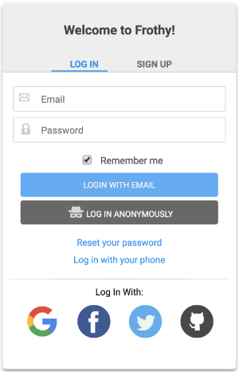

#  Frothy

## A customizable, drop-in login form for Firebase and React.

[](https://badge.fury.io/js/frothy)
[](https://github.com/ellerbrock/open-source-badge/)

### [Interactive Demo](https://frothy-123.firebaseapp.com/)



## Table of Contents

[About](#about)  
[Getting Started](#getting-started)  
[Props](#props)  
[Default Props](#default-props)  
[Accessing User and Authentication State](#access-user)  
[Design Decisions](#design-decisions)  
[What's next?](#whats-next)  
[Contributing](#contributing)

<a name="about"/>

## About

Frothy is a highly customizable, drop-in authentication form component built with [React](https://reactjs.org/), the [Firebase SDK](https://firebase.google.com/docs/database/web/start) and [Styled-Components](https://www.styled-components.com/). The library is approximately 104 KB minified and 25 KB gzipped.

##### Frothy supports the following Firebase authentication features:

* Login with Email/Password
* Sign Up with Email/Password
* Google Login
* Facebook Login
* Twitter Login
* GitHub Login
* Login with Phone Number (with Recaptcha)
* Anonymous Login
* Send Password Reset Link

##### Here are just some of the features that Frothy provides:

* Control over which Firebase authentication methods are included
* Display as an inline form or a modal with a single prop setting
* Plenty of styling configuration options
* Recaptcha configuration options
* Custom password rules
* Smooth animations
* No CSS imports required
* WAI-ARIA compliant

> Please Read: This is a new project and has not been thoroughly tested. At the moment, it is not recommended to use this library in production apps. If you'd like to help get it there, your contributions would be greatly appreciated! Currently, this library is not compatible with React Native due to DOM dependencies. This may change in the future.

<a name="getting-started"/>

## Getting Started

In order to use this component, it must be installed with npm along with the `firebase` and `styled-components` npm packages.

`npm i frothy firebase styled-components` or `yarn add frothy firebase styled-components`

Firebase must also be configured for your React project. This process is simple (and free). Here is a rough overview of the process:

In Firebase:

* Create a (free) Firebase project at [https://firebase.google.com/](https://firebase.google.com/).

- In the Firebase console, go to `Authentication > SIGN-IN METHOD` and enable all of the sign-in providers that you are interested in supporting. Firebase will walk you through the necessary steps for each one.

In your React project:

Add your Firebase config to your main `index.js` file. You can find your config in the Firebase console at `Authentication > WEB SETUP`

```
import firebase from 'firebase';

const prodConfig = {
  // apiKey: YOUR_API_KEY,
  // authDomain: YOUR_AUTH_DOMAIN,
  // databaseURL: YOUR_DATABASE_URL,
  // projectId: YOUR_PROJECT_ID,
  // storageBucket: '',
  // messagingSenderId: YOUR_MESSAGING_SENDER_ID,
};

firebase.initializeApp(config);
```

Once Firebase is wired up, just import Frothy component and drop it into your app.

```js
// import it
import Frothy from 'frothy';

// use it
<Frothy />;
```

Prefer a modal?

```js
<Frothy modal />
```

By default, Frothy takes care of grabbing the `firebase.auth` method and passing it to the components as long as you have the `firebase` npm package installed.

However, it is possible to manually pass in the Firebase auth method, which allows you to use a production build of the Firebase SDK.

```js
import 'firebase' from 'firebase/app';
import 'firebase/auth';

<Frothy auth={firebase.auth} />
```

<a name="props"/>

## Props

Out of the box, a Frothy instance includes all of the supported Firebase features outlined above. However, a Frothy instance can be customized to include only the features that you want to support via props. The component will automatically reconfigure it's layout based on the features that you have chosen to implement. Several styling props and other custom configuration options are also exposed and documented below.

Here is a list of all of the props that Frothy exposes:

### auth

`PropTypes.func`

Default Value: Firebase Development SDK

Description: Optionally pass in the firebase.auth method. By default, this library uses the development build of the Firebase SDK, which is not recommended for production.

> Be sure to check out the [Interactive Demo](https://frothy-123.firebaseapp.com/) where you can try out the majority of the available props.

### modal

`PropTypes.bool`

Default Value: `false`

Description: Optionally display as a modal. If true, the login form becomes a modal and provides a button to toggle the modal on and off. The button can be replaced with your own component.

### modalButton

`PropTypes.element`

Default Value: `<Button>Sign In</Button>`

Description: Accepts a React component instance. The toggle method will be automatically bound to the component that you provide.

### modalOverlay

`PropTypes.func`

Default Value: `true`

Description: Shows a background overlay when the modal is enabled and opened.

### themeColor

`PropTypes.string`

Default Value: `"#2196F3"`

Description: Sets the color of the tabs, buttons, and collapse menu titles.

### showBorder

`PropTypes.bool`

Default Value: `true`

Description: Shows or hides the outer box border.

### rounded

`PropTypes.oneOf([0, 1, 2, 3, 4, 5])`

Default Value: `1`

Description: Rounds the corners of the form. 0 = not rounded | 5 = most rounded

### shadow

`PropTypes.oneOf([0, 1, 2, 3, 4, 5])`

Default Value: `2`

Description: Applies a box shadow to the form. 0 = no shadow | 5 = thickest shadow

### showLabels

`PropTypes.bool`

Default Value: `false`

Description: Displays the provider name under the social icon buttons (i.e Google, Facebook).

### title

`PropTypes.oneOfType([PropTypes.string, PropTypes.element])`

Default Value: `"Welcome to Frothy!"`

Description: The main title at the top of the form. Accepts a component instance or a string.

### titleColor

`PropTypes.string`

Default Value: `"#424242"`

Description: The font color of the `title` prop.

### titleBackgroundColor

`PropTypes.string`

Default Value: `"#ededed"`

Description: The background color of the `title` area.

### emailLogin

`PropTypes.bool`

Default Value: `true`

Description: Enables and displays the email login form.

### emailRemember

`PropTypes.bool`

Default Value: `true`

Description: Enables the "Remember me" checkbox, which is persisted with `localStorage`.

### emailSignup

`PropTypes.bool`

Default Value: `true`

Description: Enables and displays the email sign up form.

### passwordRules

```js
PropTypes.shape({
  show: PropTypes.bool,
  min: PropTypes.number,
  max: PropTypes.number,
  lowercase: PropTypes.number,
  uppercase: PropTypes.number,
  symbols: PropTypes.number,
  numbers: PropTypes.number,
});
```

#### show

Default Value: `true`

Description: Toggles the password requirements list at the bottom of the signup form.

#### min

Default Value: `6`

Description: Sets the minimum number of required characters. The default value of `6` is based on Firebase default requirements.

#### max

Default Value: `50`

Description: Sets the maximum number of required characters.

#### lowercase

Default Value: `0`

Description: Sets the minimum number of required lower case alphabetic characters.

#### uppercase

Default Value: `0`

Description: Sets the minimum number of required upper case alphabetic characters.

#### symbols

Default Value: `0`

Description: Sets the minimum number of required special (symbol) characters.

#### numbers

Default Value: `0`

Description: Sets the minimum number of required numbers.

### agree

`PropTypes.bool`

Default Value: `false`

Description: Toggles a checkbox for the user to agree to terms in the sign up form.

### agreeMessage

`PropTypes.oneOfType([PropTypes.string, PropTypes.element])`

Default Value: `"I agree to the terms of service."`

Description: The text that appears next to the `agree` checkbox. Accepts a React component instance or a string. The React component instance allows you to pass in a link to the terms or privacy policy that the user is agreeing to.

### passwordReset

`PropTypes.bool`

Default Value: `true`

Description: Enables and displays the password reset form (collapse).

### phone

`PropTypes.bool`

Default Value: `true`

Description: Enables and displays the phone login form (collapse).

### recaptcha

`PropTypes.oneOf(['normal', 'invisible'])`

Default Value: `"invisible"`

Description: The phone login form includes Recaptcha. This prop allows you to set the recaptcha to either be invisible or normal (show the "Not a Robot" button inline). If invisible, a badge will show up in the place of the button.

### recaptchaBadge

`PropTypes.oneOf(['inline', 'bottomright', 'bottomleft'])`

Default Value: `"inline"`

Description: Recaptcha requires that the user be notified if invisible Recaptcha is enabled. This prop allows you to display the badge that Recaptcha provides either inline in the form or in the bottom corners of the page.

### anonymous

`PropTypes.bool`

Default Value: `true`

Description: Enables and displays the anonymous login button.

### google

`PropTypes.bool`

Default Value: `true`

Description: Enables Google login and enables the social login button.

### facebook

`PropTypes.bool`

Default Value: `true`

Description: Enables Facebook login and enables the social login button.

### twitter

`PropTypes.bool`

Default Value: `true`

Description: Enables Twitter login and enables the social login button.

### github

`PropTypes.bool`

Default Value: `true`

Description: Enables Github login and enables the social login button.

<a name="default-props"/>

## Default Props

Here is a Frothy instance with all of the available props set to their default values. In other words, the examples below is the same as just using `<Frothy />`.

```js
import Frothy from 'frothy';
import firebase from 'firebase';
import { Button } from './common';

<Frothy
  auth={firebase.auth}
  modal={false}
  modalButton={<Button>Sign In</Button>}
  modalOverlay={true}
  themeColor="#2196F3"
  showBorder={true}
  rounded={1}
  shadow={2}
  showLabels={true}
  title={'Welcome to Frothy!'}
  titleColor="#424242"
  titleBackgroundColor="#ededed"
  emailLogin={true}
  emailRemember={true}
  emailSignup={true}
  passwordRules={{
    show: true,
    min: 6,
    max: 50,
    lowercase: 0,
    uppercase: 0,
    symbols: 0,
    numbers: 0,
  }}
  agree={false}
  agreeMessage="I agree to the terms of service."
  passwordReset={true}
  phone={true}
  recaptcha={'invisible'}
  recaptchaBadge="inline"
  anonymous={true}
  google={true}
  facebook={true}
  twitter={true}
  github={true}
/>;
```

<a name="access-user"/>

## Accessing User and Authentication State

Firebase offers a couple convenient methods to access the user and authentication state:

Authentication State Observer (recommended)

```js
import firebase from 'firebase';

firebase.auth().onAuthStateChanged(function(user) {
  if (user) {
    // User is signed in.
  } else {
    // No user is signed in.
  }
});
```

`currentUser` property

```js
import firebase from 'firebase';

const user = firebase.auth().currentUser;

if (user) {
  // User is signed in.
} else {
  // No user is signed in.
}
```

The Frothy [demo](https://frothy-123.firebaseapp.com/) utilizes the Authentication State Observer to control access to routes based on authentication status. Feel free to dig into the demo's source code to see how this works.

<a name="design-decision"/>

## Design Decisions

This library aims to strike a nice balance between plenty of configuration options and simplicity in getting started.

After initially writing all of the styles with inline JavaScript, it was decided to refactor the project to use `styled-components`. The `styled-components` library is not included as a dependency due to the conflicts associated with having two installations in the same project. Instead, it is a required peer dependency that will need to be imported along with `firebase`. `styled-components` includes vendor prefixing, which allows this package to be supported by more browsers. It also injects the styles directly into the document, which means that you do not need to require any additional CSS files.

<a name="whats-next"/>

## What's Next?

* Tests
* Token management?
* Recaptcha support for signup form?
* Custom error config
* React Native support?

<a name="contributing"/>

## Contributing

If you would like to contribute, that would be awesome! If you'd like to write some Jest tests, that would be the best!

Here is how to get started on your own development server.

Frothy

* `git clone git@github.com:gojutin/frothy.git`
* `cd frothy`
* `yarn`
* `yarn start`
* `yarn run build` runs a production build

Frothy Demo

* `cd docs`
* `yarn`
* `yarn start`
* visit `localhost:3000` in your browser
* `yarn run build` runs a production build
